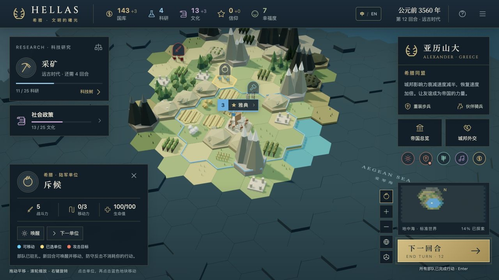

# HELLAS · 希腊文明

由一句话需求生成的单人 3D 回合制策略游戏。

[仓库总览](../README.md) · [在线游玩](https://hellas-age-of-alexander.z1050014709.chatgpt.site)（公开访问）

[](https://hellas-age-of-alexander.z1050014709.chatgpt.site)

回合制策略 · 科技与政策 · 中英双语 · 公开游玩

## 游戏内容

率领亚历山大的希腊，从雅典出发，在地中海风格的六角地图上发展文明。

- **世界与探索**：28 × 20 六角格地图、可旋转 3D 视角、战争迷雾、古代遗迹、野蛮人营地与领土边界。
- **文明发展**：6 个时代、39 项科技、6 条政策分支、30 项政策、20 种单位、22 种建筑、6 座奇观和 6 类地块改良。
- **希腊特色**：希腊同盟、重装步兵、伙伴骑兵；城邦影响力衰减减半、负值恢复速度加倍。
- **城市与经济**：人口与粮食、生产与建筑、科研、文化、金币、幸福度、信仰、战略资源与奢侈资源。
- **外交与战争**：4 个城邦、波斯帝国、野蛮人；赠礼、委托、贸易、议和、宣战、敌军寻路与增援。
- **战术玩法**：近战、远程攻击、地形防御、驻扎治疗、经验晋升、升级和城市占领；控制区、地形与道路影响移动，防守后可在新回合调整位置或撤退。
- **胜利与存档**：征服、科技、文化、外交四种胜利；自动保存、手动保存和存档文件导入导出。
- **交互**：桌面键鼠、触屏、游戏内百科与可选环境音乐；顶部“中 / EN”随时切换中文和英文，并记住语言偏好。
- **地图反馈**：蓝色填充与粗边框标示移动范围，金色标示当前单位，红色标示攻击目标；爱琴海名称固定在三维地图坐标上。

这是独立的浏览器策略游戏。它对部分系统和数值进行了简化，并非《文明 V》的完整移植；未包含多人联机、间谍、世界议会提案和完整宗教传播系统。

## 安装、验证与构建

```sh
npm ci
npm test
npm run build
python3 -m http.server 4173 --directory dist
```

访问 `http://localhost:4173`。`npm run build` 将源码和 Three.js 打包进 `dist/index.html`，不需要后端。

调试构建可以使用 `node build.mjs --dev`，生成不压缩的单文件产物。

## 操作

| 操作 | 方法 |
| --- | --- |
| 选择、移动或攻击 | 点击单位，再点击高亮地块或敌军 |
| 城市管理 | 点击城市名称 |
| 平移地图 | 鼠标拖动；触屏单指拖动 |
| 缩放 | 滚轮；触屏双指缩放 |
| 旋转 | 鼠标右键拖动；Q / E；触屏双指旋转 |
| 结束回合 | Enter 或右下角按钮 |
| 下一单位 | Tab |
| 科技 / 政策 | T / P |
| 驻扎 / 网格 | F / G |
| 指南 / 菜单 | H / Esc |
| 中英文切换 | 顶部“中 / EN”或游戏菜单中的语言按钮 |

蓝色填充与粗边框表示可移动地块，金色表示选中单位，红色表示可攻击目标。“爱琴海”位于固定的三维海域坐标，平移、缩放和旋转地图时与地形一起变化。

每次结束回合只执行一轮敌方行动；敌方近战攻击会受到防守反击。新回合恢复移动力，驻扎单位可以唤醒后移动、进攻或撤退。防守不会消耗你的移动力或本回合攻击次数。

沿同一敌军控制区内的相邻格移动会耗尽剩余移动力；离开其控制区正常计费。只要仍有移动力，就可以进入一个合法地块，即使地形费用高于剩余点数。悬停可移动地块可查看预计消耗与剩余移动力。按住 Enter 不会连续结束回合。

语言偏好自动记忆；切换语言保留回合、选中单位、研究和视角。

存档保存在当前浏览器，使用菜单中的导出和导入功能可在设备之间转移。

## 代码职责

`data.js` 定义内容；`engine.js` 处理游戏规则；`world.js` 绘制 3D 场景；`panels.js` 生成管理界面；`app.js` 连接输入、规则、画面与存档；`i18n.js` 使用 i18next 处理双语，`locales/en.js` 保存英文文案。游戏规则与存档中的名称保持稳定，在显示时翻译。

## 已知范围

本作参考《文明 V》的希腊机制，并为浏览器体验调整规则和数值。未实现多人联机、间谍、完整宗教传播、世界议会提案，以及原版的完整科技与兵种列表。

## English

HELLAS is a single-player 3D turn-based strategy game inspired by Greece in Civilization V. Choose **EN** in the top bar or **English** in the game menu. Your language preference is remembered; switching languages keeps your campaign and camera position.

Blue tiles are reachable, gold marks the selected unit, and red marks attack targets. The Aegean Sea label is anchored to the 3D map. Drag to pan, scroll to zoom and right-drag to rotate. Click a unit, then a highlighted tile to move. Use **Enter** to end a turn, **T** for research, **P** for policies and **H** for the guide.

Each End Turn runs one enemy phase. Defending does not consume your next turn’s movement or attack. Wake fortified units to move or retreat. Moving between two tiles controlled by the same enemy ends movement; leaving its zone costs normal movement. Any remaining movement permits one legal step. Holding Enter does not advance successive turns.

Run `npm ci`, `npm test`, then `npm run build`. Serve `dist/` with a static HTTP server. The generated `dist/index.html` contains the game, Three.js and both languages. Google Fonts is requested separately.
