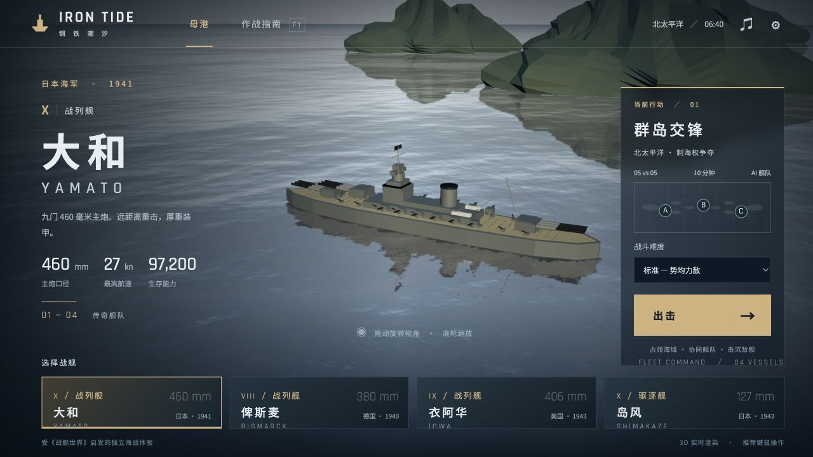

# IRON TIDE · 钢铁潮汐

由一句话需求生成、受《战舰世界》启发的单人 3D 海战游戏。选择一艘传奇舰艇，参加 5v5 AI 舰队战，通过占点或击沉敌舰赢得对局。

[仓库总览](../README.md) · [在线游玩](https://astra-world-of-warships.pages.dev)（公开访问）

[](https://astra-world-of-warships.pages.dev)

5v5 海战 · 64 km 海域 · FPS 式瞄准 · 公开游玩

## 安装、验证与构建

需要 Node.js 20+ 与支持 WebGL 2 的现代浏览器。

```sh
npm ci
npm test
npm run build
python3 -m http.server 4173 --directory dist
```

访问 `http://localhost:4173`。构建输出为单文件 `dist/index.html`，包含脚本、CSS、Three.js、海面贴图和图标。字体由 Google Fonts 加载。部署时上传 `dist/`，无需服务端或密钥。

`node build.mjs --dev` 生成不压缩的调试构建。

## 舰队与玩法

| 舰船 | 类型 | 主炮 | 装填 | 特点 |
| --- | --- | --- | --- | --- |
| 大和 Yamato | 战列舰 | 9 × 460 mm | 10 秒 | 重炮、厚装甲、侦察机 |
| 俾斯麦 Bismarck | 战列舰 | 8 × 380 mm | 8 秒 | 近距副炮、水听 |
| 衣阿华 Iowa | 战列舰 | 9 × 406 mm | 9 秒 | 高速航行、侦察机 |
| 岛风 Shimakaze | 驱逐舰 | 6 × 127 mm | 3 秒 | 三组鱼雷、烟幕、引擎增压 |

- **火控**：炮塔独立转向与装填、单塔射击与齐射、飞行弹道、提前量参考、AP / HE 切换、跳弹、穿透、核心区与过度击穿。
- **生存**：火灾、进水、损害管制、战列舰维修、烟幕隐蔽、开炮暴露和岛屿遮挡。
- **战术**：64 × 64 km 群岛地图、5v5 AI、三档难度、A / B / C 占领区、目标锁定、战术海图与舰队战况。双方从开阔海域展开，AI 按舰种保持交战距离，并绕岛航行。
- **胜负**：率先达到 1,000 分、歼灭敌舰，或 10 分钟结束时比较分数；战后显示伤害、命中和击沉统计。
- **画面与声音**：程序化舰模、海面反射与天空、尾流与炮火效果、浏览器合成音效、画质和音量设置。

岛风鱼雷射程为 14 km，航行 1.2 km 后引信生效，每组装填 45 秒。注意提前量与鱼雷警报，通过调整航速和航向规避来袭火力。

## 操作

推荐电脑键鼠；提供基础触屏方向、航速、瞄准和开火按钮。

| 操作 | 按键 |
| --- | --- |
| 提高 / 降低车钟档位 | W / S 或 ↑ / ↓，最低档倒车 |
| 持续左 / 右转舵 | A / D 或 ← / →，松开回中 |
| 锁定左 / 右舵位 | Q / E |
| 瞄准 / 环顾 | 直接移动鼠标，无需按住按键；准星固定中央 |
| 单塔射击 / 齐射 / 轮射 | 左键单击 / 双击 / 长按 |
| 望远镜 / 缩放 | Shift / 滚轮 |
| 高爆弹 / 穿甲弹 | 1 / 2 |
| 岛风鱼雷、切换扇面 | 3 |
| 切换锁定目标 | X；锁定目标不会自动转动视角 |
| 跟随炮弹镜头 | Z |
| 损害管制 | R |
| 战列舰维修 / 岛风烟幕 | T |
| 侦察机 / 水听 / 增压 | Y，视舰船而定 |
| 开关自动副炮 | P |
| 战术海图 / 舰队战况 | M / 按住 Tab |
| 暂停并释放鼠标 / 指南 | Esc / F1 |

母港中鼠标自由移动，按住并拖动可旋转舰船视角，滚轮缩放，选择舰船与难度后点击“出击”。战斗采用 FPS 式鼠标视角；点击“继续战斗”重新进入操控。触屏可滑动环顾，通过屏幕按钮操舰和开火。

## 代码职责

- `src/main.js`：母港、场景、海面与天空、舰船选择和应用入口。
- `src/battle.js`：战斗循环、操舰、火控、AI、消耗品、战斗界面与结算。
- `src/ships.js`：四艘舰船的数据、船体、舰桥与炮塔模型。
- `src/battlefield.js`：海域、岛屿、出生编队、交战距离与绕岛航行。
- `src/mechanics.js`：碰撞、装甲与占点计算。
- `src/effects.js`：炮火、烟雾、尾流效果与合成音效。
- `src/style.css` / `index.template.html`：界面样式与页面结构。
- `assets/`：随构建内联的原始贴图与图标；`tests/`：可独立运行的规则检查。

项目使用 Three.js 0.180.0。Water、Sky、PointerLockControls 和 BufferGeometryUtils 从同一个 npm 包导入；esbuild 将游戏和依赖内联到 HTML。运行素材随仓库提供。

## 验证

`npm test` 覆盖鼠标视角、瞄准、转舵、出生点、完整船体与岛屿碰撞、武器射程、鱼雷引信、AP / HE 装甲及占点；另有四种舰船的 10 分钟舰队航行模拟和实弹交战检查。

## 已知范围

舰艇是程序化构建的 3D 近似模型；航速、射程、装填、弹道和损伤按浏览器对局节奏调整。未包含航母、潜艇、联网多人、完整装甲分区与原版的全部舰船、升级和经济系统。当前界面为中文。

## 资料与许可

- [《战舰世界》操作指南](https://wiki.worldofwarships.com/Ship:Controls)
- [弹药与装甲机制](https://wiki.worldofwarships.com/Ship:Ammo)
- [鱼雷规则](https://wiki.worldofwarships.com/Ship:Torpedoes)
- [消耗品](https://wiki.worldofwarships.com/Ship:Consumables)
- [第三方素材与许可](./THIRD_PARTY_NOTICES.md)

本项目与《战舰世界》原厂无关。
